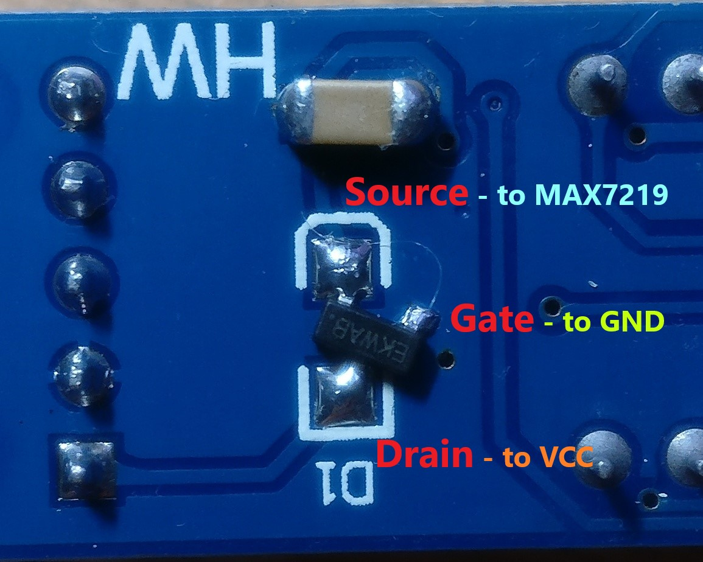

### MAX7219 7-segment 8-digit LED driver for FPGA written in VHDL with cascade connected modules support


# Features
* asynchronous reset
* support multiple connected MAX7219 modules
* adjust brightness of the display of each module separately

# How to use it?
1. Copy `MAX7219.vhd` and `MAX7219_Pack.vhd` files to your project location.
2. Import package `MAX7219_Pack`
```vhdl 
use work.MAX7219_Pack.all;
```
3. Use component definition as below
```vhdl
component MAX7219
    generic (
        Devices   : positive;
        Intensity : MAX7219ConfigIntensity_t
    );
    port (
        clk         : in std_logic;
        reset_n     : in std_logic;
        data_vector : in std_logic_vector;
        clk_out     : out std_logic;
        data_out    : out std_logic;
        load_out    : out std_logic
    );
end component;
```
4. Create instance of the MAX7219 component. 
For example to support 2 modules:
* set `devices` to `2`
* set displays brightness to values: `16#1#` for the first and `16#3#` for the second module.
```vhdl
instance: MAX7219
    generic map(
            devices => 2,
            intensity => (16#1#, 16#3#)
        )
    port map (
            clk => clock,
            data_vector => x"FEDCBA9876543210",
            clk_out => MAX7219_CLK,
            data_out => MAX7219_DATA,
            load_out => MAX7219_LOAD,
            reset_n => globalResetN
        );
```
Tip: `data_vector` length is equal `32 * Devices`.

## Cascade connecting modules tips
Some kind of modules has a build-in reverse voltage protection circuit. In most cases it is a popular 1N4148 silicon diode connected serially with VCC. 
You must remember that each diode of this thype  in circuit decrease supply voltage about 0.7V. 
So if a first module is supply with 5V then supply voltage for the second module will about 4.3V only.

You can omit this issue in few ways:
1. Make supply voltage for all modules from the same path.
2. Replace diode with a P-channel MOSFET as below



* in my module I use IRLML6402TRPBF P-Channel transistor.

3. If you don't need reverse voltage protection in your module simple replace diode with wire.


